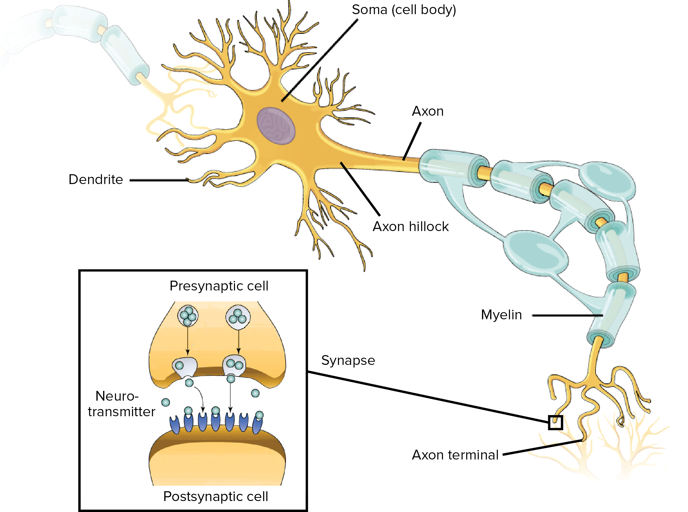
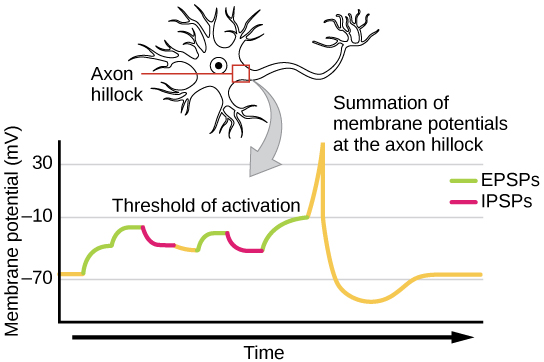
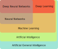

## What is a Neural Network?

:::{tip} Neuron

:::

:::{tip} Synapse
:class: dropdown

:::

:::{tip} Mathematical Approximation
:class: dropdown

:::

## How does it relate to other terms in the field

:::{tip} Terminology
:class: dropdown

:::

### Comparison with other courses

:::{tip} Other courses
:class: dropdown
* ECE 491/591: Deep Learning (Dr Yifeng Zhu)
    - We will dive deeper on backpropagation. We will implement your on Pytorch library.
    - We are more theoretical, less towards application than ECE 491.

* COS 475/575: Machine Learning
    - There are other kinds of ML algos (SVM, Gaussian Processes, Decision
      trees, Random Forests, Nearest Neighbors).
    - We will be focused on Neural Networks.

* COS 470/570: Introduction to Artificial Intelligence
    - Searching for solutions
    - Neural Networks are more about pattern matching.

* COS 498/598: Explainable AI (Dr Chaofan Chen)
    - Focuses on explainabliity of Neural Networks
:::
## Syllabus

Linked here: [Syllabus](https://docs.google.com/document/d/1dQ46C4XnsN05pGDxNPwwN9vjNxGtbwAyaU6jrC0inNo/edit?pli=1&tab=t.0)
