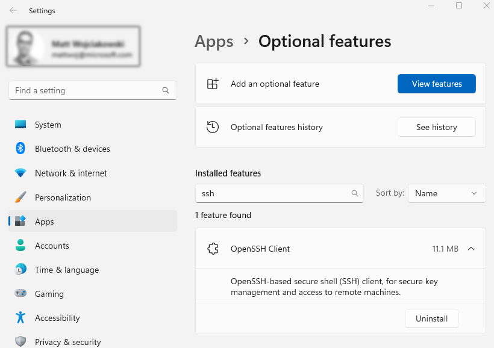
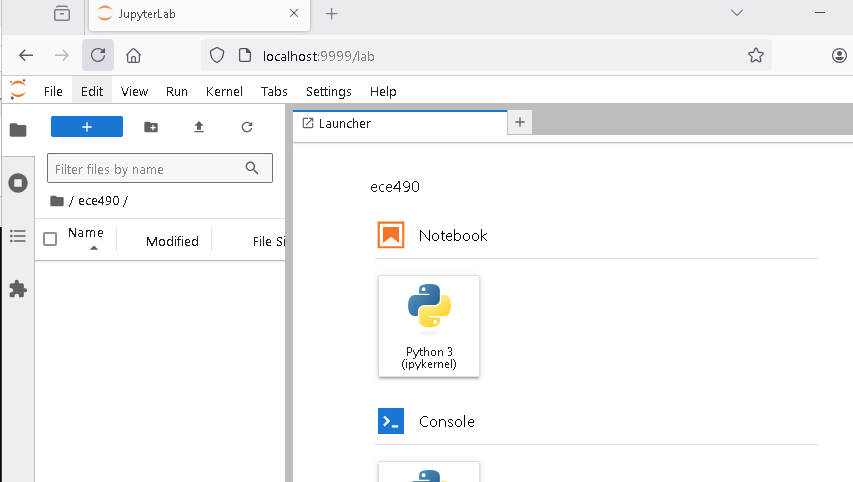

We will learn how to run Jupyter notebook on PSC and access it on your laptop by port forwarding.

# SSH to Bridge2.PSC.EDU

Next, `ssh` to `bridges2.psc.edu`. Replace `vdhiman` with your own
username that you got in the email from me. For different operating
systems, we have different instructions. For Windows, we will use PowerShell, not Putty.

1. [For Mac and Linux](#for-mac-and-linux)
1. [For Widows PowerShell](#for-windows-powershell)


#### For Mac and Linux

:::{code} shell
    vdhiman@office-desktop:~$ ssh vdhiman@bridges2.psc.edu
    Last login: Sat Jan 21 13:37:12 2023 from jx3cth3.um.maine.edu
    vdhiman@katahdin:~$
:::

#### For Windows PowerShell

Instructions from here: [Tutorials ssh](https://learn.microsoft.com/en-us/windows-server/administration/openssh/openssh_install_firstuse?tabs=gui&pivots=windows-11)

Install [OpenSSH Client Optional feature](https://learn.microsoft.com/en-us/windows-server/administration/openssh/openssh_install_firstuse?tabs=gui&pivots=windows-11).

   a. Select Start, type __Optional Features__ in the search box, then select Add an optional feature.



   b. Scan the list to see if the OpenSSH is already installed. If not, at the top of the page, select *Views features*, then Search for and select *OpenSSH Client*, select Next, then Install.


Open Command Prompt (`WIN+R>cmd`), or [PowerShell](https://learn.microsoft.com/en-us/powershell/). My Access ID is `vdhiman`. Replace `vdhiman` with your own access ID in the following commands.

Type the following and press enter:

```cmd
ssh vdhiman@bridges2.psc.edu
```

You should see the password prompt. Enter password and press Enter. The password is getting entered even if it does not show anything.

```cmd
PS C:\Users\vikas.dhiman> ssh.exe vdhiman@bridges2.psc.edu
vdhiman@bridges2.psc.edu's password:
```

If login is successful, you should see:

```cmd
********************************* W A R N I N G ********************************
You have connected to br012.ib.bridges2.psc.edu, a login node of Bridges 2.

This computing resource is the property of the Pittsburgh Supercomputing Center.
It is for authorized use only.  By using this system, all users acknowledge
notice of, and agree to comply with, PSC polices including the Resource Use
Policy, available at http://www.psc.edu/index.php/policies. Unauthorized or
improper use of this system may result in administrative disciplinary action,
civil charges/criminal penalties, and/or other sanctions as set forth in PSC
policies. By continuing to use this system you indicate your awareness of and
consent to these terms and conditions of use.

LOG OFF IMMEDIATELY if you do not agree to the conditions stated in this warning


********************************* W A R N I N G ********************************

For documentation on Bridges 2, please see www.psc.edu/resources/bridges-2/user-guide/
Please contact help@psc.edu with any comments/concerns.
Last login: Tue Sep  2 17:05:23 2025 from jx3cth3.um.maine.edu

╭─ ⭐ cis250148p: Teaching Neural networks (ECE 490/590) course at the University of Maine (PI: Vikas Dhiman) [D─╮
│                                                                                                                │
│   Resource                                                                 Balance   End Date     User         │
│  ────────────────────────────────────────────────────────────────────────────────────────────────────────────  │
│   💻 Bridges 2 GPU                ━━━━━━━━━━━━━━━━━━━━━━━━━━━━━━━━━╸━   11 / 12 SU   2026-07-24   ✅ vdhiman   │
│   💾 /ocean/projects/cis250148p   ━━━━━━━━━━━━━━━━━━━━━━━━━━━━━━━━━━╸   79 / 80 GB   2026-07-24   ✅ vdhiman   │
│                                                                                                                │
╰────────────────────────────────────────────────────────────────────────────────────────────────────────────────╯
[vdhiman@bridges2-login012 ~]$
```

# Understanding HPC clusters

We have now remotely logged into a PSC computer. PSC is a high-performance computing (HPC) cluster. There are many such clusters including one at [UMaine](https://umaine.edu/arcsim/computing/).
Most clusters differentiate between login nodes and compute nodes.
When you run something on a cluster, for example, training of neural network,
it is called a {term}`job`. You should not run compute heavy jobs on the login
nodes. When you need to run a compute heavy job, you need to tell the cluster
(specifically a {term}`scheduler`) how much resources will this job need, for
example, how many CPUs, how many computers (called {term}`nodes`), how much
memory, how many GPUs, what kind of GPUs, and for how much time.

:::{important}
Every job you run on PSC cluster, every CPU cycle, especially every GPU cycle
and storage is accounted for and is limited. Use it freely for learning,
training your neural networks, and your projects, but do not waste it.
:::

# Running Jupyter notebook on PSC cluster

To take the full advantage of the facilities available the PSC cluster, please
read the [user-guide](https://www.psc.edu/resources/bridges-2/user-guide/)
including [Introduction to Unix](https://www.psc.edu/introduction-to-unix/),
[modules](https://modules.readthedocs.io/en/latest/index.html), and
[singularity](https://www.psc.edu/resources/bridges-2/user-guide/). The
following is just the basics to run a jupyter notebook.


## 1. Getting a node allocated for running Jupyter using SLURM

[SLURM](https://slurm.schedmd.com/sbatch.html) is job {term}`scheduler`. It
comes with a set of commands to talk to the scheduler.

Running Jupyter server via  enables you to run your Jupyter server on a SLURM node with more resources; sometimes allowing you to use GPU. It is a better practice to run heavy code via SLURM, because login nodes are meant for login only. This documentation specifically covers this process.

Once Jupyter server is running, we are going to connect to the jupyterlab instance with SSH port forwarding from our local laptop. A tunnel must be created as you cannot directly SSH to SLURM nodes on Katahdin.

We will use the `interact` command to request 1 node, with 4 CPUs, 1 GPU, for
8 hrs. We can also use [`salloc`](https://slurm.schedmd.com/salloc.html) command
to do the same, but it would require more flags. Before you use any command,
it is always good to check it's help using the typical `-h` or `--help` flag.

```shell
[vdhiman@bridges2-login011 ~]$ interact -h

Usage:  interact [OPTIONS]
  -A Account/ChargeID   ChargeID if not your default"
    --account
  -d                    Turn on debugging information
    --debug
  --noconfig            Do not process config files
  -gpu                  Allocate 1 gpu in the GPU-shared partition
    --gpu
  --gres=<list>         Specifies a comma delimited list of generic consumable
                          resources. e.g.:    --gres=gpu:1
  --mem=<MB>            Real memory required per node in MegaBytes
  -N Nodes              Number of nodes
    --nodes
  -n NTasks             Number of tasks (spread over all Nodes) 
  --ntasks-per-node=<ntasks>    Number of tasks, 1 per core per node. 
  -p Partition          Partition/queue you would like to run on
    --partition
  -R Reservation        Reservation you would like to run on
    --reservation
  -t Time               Set a limit on the total run time. Format include
                          mins, mins:secs, hours:mins:secs.  e.g. 1:30:00 
    --time
  -h                    Print this help message
    -?

[vdhiman@bridges2-login011 ~]$ 
```

We are going to use the `--nodes`, `--ntasks-per-node`, `--gpu` and `--time`
options. Let us request 1 node, 4 CPU-cores per node, 4GB of memory, 1 gpu for 8 hrs.

```shell
[vdhiman@bridges2-login011 ~]$ interact --nodes 1 --ntasks-per-node=4 --mem=4000 --gpu --time 8:00:00

A command prompt will appear when your session begins
"Ctrl+d" or "exit" will end your session

--mem=4000 --nodes=1 --ntasks-per-node=4 --partition=GPU-small,GPU-shared --gpus=v100:1 --time=8:00:00

salloc -J Interact --mem=4000 --nodes=1 --ntasks-per-node=4 --partition=GPU-small,GPU-shared --gpus=v100:1 --time=8:00:00
salloc: Pending job allocation 34570270
salloc: job 34570270 queued and waiting for resources
salloc: job 34570270 has been allocated resources
salloc: Granted job allocation 34570270
salloc: Waiting for resource configuration
salloc: Nodes v001 are ready for job
[vdhiman@v001 ~]$
```

Note the change in the prompt. You are now on node `v001`. You can get the
full name by the `hostname` command.

```shell
[vdhiman@v001 ~]$ hostname
v001.ib.bridges2.psc.edu
[vdhiman@v001 ~]$
```

What kind of GPU do we have? We can check the GPU details using `nvidia-smi` command.

```shell
[vdhiman@v001 ~]$ nvidia-smi
Wed Sep  3 17:55:34 2025
+-----------------------------------------------------------------------------------------+
| NVIDIA-SMI 560.35.03              Driver Version: 560.35.03      CUDA Version: 12.6     |
|-----------------------------------------+------------------------+----------------------+
| GPU  Name                 Persistence-M | Bus-Id          Disp.A | Volatile Uncorr. ECC |
| Fan  Temp   Perf          Pwr:Usage/Cap |           Memory-Usage | GPU-Util  Compute M. |
|                                         |                        |               MIG M. |
|=========================================+========================+======================|
|   0  Tesla V100-SXM2-32GB           On  |   00000000:B2:00.0 Off |                    0 |
| N/A   28C    P0             39W /  300W |       1MiB /  32768MiB |      0%      Default |
|                                         |                        |                  N/A |
+-----------------------------------------+------------------------+----------------------+

+-----------------------------------------------------------------------------------------+
| Processes:                                                                              |
|  GPU   GI   CI        PID   Type   Process name                              GPU Memory |
|        ID   ID                                                               Usage      |
|=========================================================================================|
|  No running processes found                                                             |
+-----------------------------------------------------------------------------------------+
[vdhiman@v001 ~]$
```

We have a node with Nvidia's TESLA V100-SXM2-32GB allocated to us. 


## 2. Finding a Jupyter installation

HPC clusters have too many users, and too many software demands which might be
mutually incompatible. To handle that even the installed software are disabled
by default and you have figure out (1) whether the software is installed and
(2) what to do to  activate that software.

The list of software installed on [PSC is listed here](https://www.psc.edu/resources/software/). If you Ctrl-F for jupyter, you will [find this page](https://www.psc.edu/resources/software/jupyter/), which gives the complete instructions to run jupyter notebook.

We will first search for keyword anaconda using the [`module`](https://modules.readthedocs.io/en/latest/module.html) command.

```shell
[vdhiman@v001 ~]$ module spider anaconda
--------------------------------------------------------------------------------------------------------------
  anaconda2: anaconda2/2019.10
--------------------------------------------------------------------------------------------------------------
    Description:
      Anaconda is a free and open-source distribution of the Python and R programming languages for
      scientific computing, that aims to simplify package management and deployment. Package versions are
      managed by the package management system conda. 


    This module can be loaded directly: module load anaconda2/2019.10

    Help:
      Anaconda is a free and open-source distribution of the Python and R
      programming languages for scientific computing, that aims to simplify
      package management and deployment. Package versions are managed by the
      package management system conda.


--------------------------------------------------------------------------------------------------------------
  anaconda3:
--------------------------------------------------------------------------------------------------------------
    Description:
      Anaconda is a free and open-source distribution of the Python and R programming languages for
      scientific computing, that aims to simplify package management and deployment. Package versions are
      managed by the package management system conda. 

     Versions:
        anaconda3/2020.07
        anaconda3/2020.11
        anaconda3/2022.10
        anaconda3/2024.10-1

--------------------------------------------------------------------------------------------------------------
  For detailed information about a specific "anaconda3" package (including how to load the modules) use the module's full name.
  Note that names that have a trailing (E) are extensions provided by other modules.
  For example:

     $ module spider anaconda3/2024.10-1
--------------------------------------------------------------------------------------------------------------
```

There are multiple versions of [anaconda](https://www.anaconda.org) installed.
We will use the latest version `anaconda3/2024.10-1`. Use `module load` to
load the software package.

```shell
[vdhiman@v001 ~]$ module load anaconda3/2024.10-1
(base) [vdhiman@v001 ~]$
```
To check all the modules loaded, you can use `module list` to list all the
loaded modules

```shell
(base) [vdhiman@v001 ~]$ module list
Currently Loaded Modules:
  1) allocations/1.0   2) psc.allocations.user/1.0   3) anaconda3/2024.10-1
```
Finally jupyter command is available and we can run it.

## 3. Running Jupyter lab

```shell
(base) [vdhiman@v001 ~]$ jupyter lab --no-browser --ip 0.0.0.0
[I 2025-09-03 18:17:26.978 ServerApp] jupyter_lsp | extension was successfully linked.
[I 2025-09-03 18:17:26.982 ServerApp] jupyter_server_terminals | extension was successfully linked.
[I 2025-09-03 18:17:26.986 ServerApp] jupyterlab | extension was successfully linked.
[I 2025-09-03 18:17:26.989 ServerApp] notebook | extension was successfully linked.
[I 2025-09-03 18:17:27.581 ServerApp] notebook_shim | extension was successfully linked.
[I 2025-09-03 18:17:27.581 ServerApp] panel.io.jupyter_server_extension | extension was successfully linked.
[I 2025-09-03 18:17:27.615 ServerApp] notebook_shim | extension was successfully loaded.
[I 2025-09-03 18:17:27.617 ServerApp] jupyter_lsp | extension was successfully loaded.
[I 2025-09-03 18:17:27.618 ServerApp] jupyter_server_terminals | extension was successfully loaded.
[I 2025-09-03 18:17:27.630 LabApp] JupyterLab extension loaded from /opt/packages/anaconda3-2024.10-1/lib/python3.12/site-packages/jupyterlab
[I 2025-09-03 18:17:27.630 LabApp] JupyterLab application directory is /jet/packages/anaconda3-2024.10-1/share/jupyter/lab
[I 2025-09-03 18:17:27.631 LabApp] Extension Manager is 'pypi'.
[I 2025-09-03 18:17:27.661 ServerApp] jupyterlab | extension was successfully loaded.
[I 2025-09-03 18:17:27.665 ServerApp] notebook | extension was successfully loaded.
[I 2025-09-03 18:17:27.666 ServerApp] panel.io.jupyter_server_extension | extension was successfully loaded.
[I 2025-09-03 18:17:27.667 ServerApp] Serving notebooks from local directory: /jet/home/vdhiman
[I 2025-09-03 18:17:27.667 ServerApp] Jupyter Server 2.14.1 is running at:
[I 2025-09-03 18:17:27.667 ServerApp] http://localhost:8888/lab?token=36561105e4ff1e78a40f3a76f48f0c89650caca5c209602c
[I 2025-09-03 18:17:27.667 ServerApp]     http://127.0.0.1:8888/lab?token=36561105e4ff1e78a40f3a76f48f0c89650caca5c209602c
[I 2025-09-03 18:17:27.667 ServerApp] Use Control-C to stop this server and shut down all kernels (twice to skip confirmation).
[W 2025-09-03 18:17:27.673 ServerApp] No web browser found: Error('could not locate runnable browser').
[C 2025-09-03 18:17:27.673 ServerApp]
    To access the server, open this file in a browser:
        file:///jet/home/vdhiman/.local/share/jupyter/runtime/jpserver-43319-open.html
    Or copy and paste one of these URLs:
        http://v001.ib.bridges2.psc.edu:8888/lab?token=36561105e4ff1e78a40f3a76f48f0c89650caca5c209602c
        http://127.0.0.1:8888/lab?token=36561105e4ff1e78a40f3a76f48f0c89650caca5c209602c
[I 2025-09-03 18:17:27.877 ServerApp] Skipped non-installed server(s): bash-language-server, dockerfile-language-server-nodejs, javascript-typescript-langserver, jedi-language-server, julia-language-server, pyright, python-language-server, r-languageserver, sql-language-server, texlab, typescript-language-server, unified-language-server, vscode-css-languageserver-bin, vscode-html-languageserver-bin, vscode-json-languageserver-bin, yaml-language-server
```

Pay attention the second URL: `http://v001.ib.bridges2.psc.edu:8888/lab?token=3...`. We cannot directly open this URL. Try copy-pasting it in your browser; it will not work.
All nodes of a HPC cluster are behind a firewall and you cannot simply access
any port of any node.
However, before we go further, we need to breakdown this URL into HOSTNAME,
PORT and TOKEN. In my case, HOSTNAME=`v001.ib.bridges2.psc.edu`, PORT=`8888`,
and TOKEN=`36561105e4ff1e78a40f3a76f48f0c89650caca5c209602c`. In your case,
HOSTNAME, PORT and TOKEN could all be different from mine. In fact, TOKEN is
your password. Anyone with access to your TOKEN can get access to your user
account.

To access the jupyter lab, you have to create a [SSH tunnel](https://help.ubuntu.com/community/SSH/OpenSSH/PortForwarding).

## 4. Creating an SSH tunnel

We will create an SSH tunnel through `bridges2.psc.edu` to redirect
bidirectional traffic from `v001.ib.bridges2.psc.edu` to our local machine
(user's laptop).

### TCP/UDP ports

Ports in computer and electrical engineering stands for an input-output
interface. When we talk about TCP/UDP ports, the port numbers are software
ports that are managed by the operating system. However, you can still
"imagine" them as connections to the outside world. For example, the default ports for
HTTP protocol is 80, HTTPS is 443, for SSH is 22. What does this mean? This
means that you can add the correct port number to any URL and it will still
work. For example, you can access umaine.edu using [https://maine.edu](https://maine.edu) or using [https://maine.edu:443](https://maine.edu:443). You can access bridges2.maine.edu through ssh by specifying 22 as the port number. This also means that the server side processes "listen" to the assigned port numbers on the server. The "ssh daemon" listens to the port 22, "https server daemon" listens to the port 443 and so on.

You can learn more about this in the COS 440:Computer Networking class or
[explore on your own](http://www.tcpipguide.com/free/t_toc.htm).

### Port forwarding

We want the communication between our browser and Jupyter notebook server to
tunnel through the ssh connection.
The information flow for the port forwarding is visualized here:


Then on your laptop, open a new Terminal Window and create an SSH
tunnel using `ssh -L 9999:HOSTNAME:PORT vdhiman@.bridges2.psc.edu`.
For my output the command is:

```shell
    ssh -L 9999:v001.ib.bridges2.psc.edu:8888 vdhiman@bridges2.psc.edu
```

On your laptop open a browser window and you can then browse to:

    http://localhost:9999/lab?token=36561105e4ff1e78a40f3a76f48f0c89650caca5c209602c

**Important: Replace the "?token=TOKEN" part of the URL with your token**

You should see this:



Get familiar with this interface. Do not forget to save your work regularly. Your node
allocation is going to be killed after 8 hrs.

### Check you understanding

If you ran `ssh -L 7777:www.tcpipguide.com:80 vdhiman@bridges2.psc.edu` in a terminal and opened `https://localhost:7777` in a browser, what would you see? Why?

:::{tip} Answer
:class: dropdown

You will see www.tcpipguide.com.

Because traffic from www.tcpipguide.com is being tunnelled through
bridges2.psc.edu to your laptop.
:::
