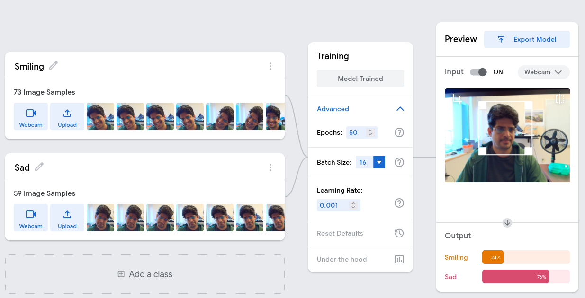

:::{image} ./tip_of_the_iceberg_assets/tip-of-the-iceberg.svg
width: 500px
:::

Before we dive deep into the depths of the neural networks iceberg, I want to
take you through a tour of the tip of the iceberg. While we are on this
tour, we will set up some terminology, and understand some terms that people
use while talking about neural networks.

# Teachable machines

Our tour starts with a very simple demo of [teachablemachines.google.com](https://teachablemachine.withgoogle.com/train).
On this tool no programming is required.
Still this is an excellent tool to understand the following terminology and
concepts

## Glossary of terms to understand through this exercises


:::{glossary}
Training
: The process of finding weights that fit the data.

Training data
: Data with labels that you train the model on.

Classes
: The categories that labels can take.

Model weights/checkpoint
: The weights corresponding to the model.

Inference
: Using the model to predict the label.

Test data
: Sometimes a part of collected data is kept aside to evaluate or
test the model.
:::




## Instructions

1. Click on "Class 1", change it to a class label that you want (e.g "Smiling").
2. Click webcam. To capture some class 1 images.
3. Repeat for other classes. Make sure you have approximately the same number
   of images for all the classes.
4. Click train. Congratulations, you have trained your first neural network!!!
5. Click on preview.
6. Click on "Export", choose to download the model in Tensorflow.js format.
   You should get a zip file.
7. Extract the zip file. Open `model.json` in a browser. What do you see?

# Gemma 3 on Huggingface

Create an account on [Hugging
face](https://huggingface.co/google/gemma-3-12b-it) and try it.

# Gemma 3 through Hugging face

Websites can hide a lot of complexity. Any open source website can be run
locally. That takes away a lot of magic away, but still a lot details remain.
Let's try to run a model on `bridges2.psc.edu`.

## Login

Replace `<your PSC username>` with your PSC username.
```bash
export USER=<your PSC username>
ssh $USER@bridges2.psc.edu
```
## Get node allocation

```bash
export USER=<your PSC username>
interact --nodes 1 --ntasks-per-node=4 --mem=22000 --time 1:30:00 -gpu
```

## Load PyTorch singularity image

```bash
singularity shell /ocean/containers/ngc/pytorch/pytorch_24.08-py3.sif
```

```bash
pip install git+https://github.com/huggingface/transformers@v4.49.0-Gemma-3
pip install huggingface_hub
pip install 'accelerate>=0.26.0
```

## Create a Python file

:::{code} python
:filename: hf_gemma3.py
# Sourced from here: https://github.com/huggingface/blog/blob/main/gemma3.md
import torch
from transformers import AutoProcessor, Gemma3ForConditionalGeneration

# Model name to download. We are not going to use this
#ckpt = "google/gemma-3-4b-it"

# We will instead use pre-downloaded weights from 
#   vdhiman/.cache/huggingface
# DO NOT change vdhiman here
# ckpt_location directory should contain the file config.json
ckpt_location = "/ocean/projects/cis250148p/vdhiman/.cache/huggingface/hub/models--google--gemma-3-4b-it/snapshots/093f9f388b31de276ce2de164bdc2081324b9767/" #config.json

# processor_ckpt_location should contain the file processor_config.json
processor_ckpt_location = "/ocean/projects/cis250148p/vdhiman/.cache/huggingface/hub/models--google--gemma-3-4b-it/snapshots/093f9f388b31de276ce2de164bdc2081324b9767/" #processor_config.json"

model = Gemma3ForConditionalGeneration.from_pretrained(
    ckpt_location, device_map="cuda", torch_dtype=torch.bfloat16,
    local_files_only=True
)
processor = AutoProcessor.from_pretrained(
    processor_ckpt_location,
    image_processor_filename="processor_config.json",
    local_files_only=True)

messages = [
    {
        "role": "user",
        "content": [
            # you can replace your image sources or provide a 
            # string of chats as "text"
            {"type": "image", "url": "https://huggingface.co/spaces/big-vision/paligemma-hf/resolve/main/examples/password.jpg"},
            # {"type": "image", "url": "https://a57.foxnews.com/static.foxnews.com/foxnews.com/content/uploads/2025/03/931/523/trump030625.jpg?ve=1&tl=1"},
            # {"type": "image", "url": "https://vikasdhiman.info/images/headshot.jpg"}
            {"type": "text", "text": "Who is this? What is the password?"}
        ]
    }
]

inputs = processor.apply_chat_template(
    messages, add_generation_prompt=True, tokenize=True,
    return_dict=True, return_tensors="pt"
).to(model.device)

print(torch.cuda.memory_summary())

input_len = inputs["input_ids"].shape[-1]

generation = model.generate(**inputs, max_new_tokens=100, do_sample=False)
generation = generation[0][input_len:]

decoded = processor.decode(generation, skip_special_tokens=True)
print(decoded)
:::

## Run the python file

```bash
python3 hf_gemma3.py
```


# Min GPT

https://github.com/karpathy/nanoGPT
https://github.com/karpathy/minGPT

## Clone the repository

```bash
git clone https://github.com/karpathy/minGPT
cd minGPT
```

##  Create a virtual environment
Create a virtual environment so as to not pollute global installs.

```bash
python -m venv minGPTvenv
```
## Activate the virtual environment
On windows:

```PowerShell
minGPTvenv\Scripts\Activate.ps1
```
On Linux or Mac

```bash
source minGPTvenv/bin/activate
```
## Install the dependencies

```bash
pip install -e .
```
## Train chargpt

1. Download [Tiny Shakespeare](https://raw.githubusercontent.com/karpathy/char-rnn/master/data/tinyshakespeare/input.txt)
2. Put it in the current directory (`minGPT`).
3. Open `projects/chargpt/chargpt.py`. Find the word `gpt-mini`, change it to `gpt-nano`.
3. Run `python projects/chargpt/chargpt.py`
4. Observe the language generated changing from gibberish to something more
   "Shakespeare like."

# One of the simplest neural network model: Multi Layer perceptron

[MLP%20Using%20Pytorch.ipynb](https://colab.research.google.com/github/wecacuee/ECE490-Neural-Networks/blob/master/notebooks/06-pytorch/MLP%20Using%20Pytorch.ipynb)

# References

https://apxml.com/courses/llm-model-sizes-hardware/chapter-5-estimating-hardware-needs/rule-thumb-vram

https://apxml.com/courses/llm-model-sizes-hardware/chapter-5-estimating-hardware-needs/activation-memory

https://github.com/huggingface/blog/blob/main/gemma3.md

https://huggingface.co/collections/google/siglip-659d5e62f0ae1a57ae0e83ba

https://arxiv.org/pdf/2303.15343

https://huggingface.co/spaces/huggingface-projects/gemma-3-12b-it

https://huggingface.co/docs/transformers/v4.56.1/en/model_doc/gemma3#notes

https://github.com/google/gemma_pytorch?tab=readme-ov-file

https://ai.google.dev/gemma/docs/core/pytorch_gemma

<!--
# Additional notes

https://colab.research.google.com/github/google/generative-ai-docs/blob/main/site/en/gemma/docs/core/pytorch_gemma.ipynb
Cant run https://colab.research.google.com/drive/1he3iSSaNzqI7kj8rCO2wfaNZYm0IT8PB?usp=sharing
because of a silly enumeration mismatch?

Dependency hell on bridges2.psc.edu Pytorch  does not suport V100  with
compute 7. Huggingface needs torch.distributed.tensor. Works with singularity
containter  /ocean/containers/ngc/pytorch/pytorch_24.08-py3.sif

Inference time
1.7 * Params * Param size

-->

<!-- Gemma 3 through pytorch is getting killed -->
